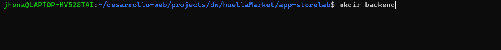
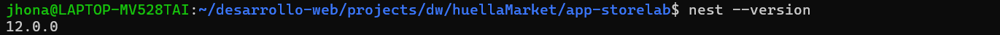
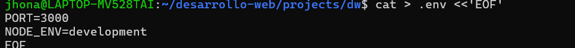
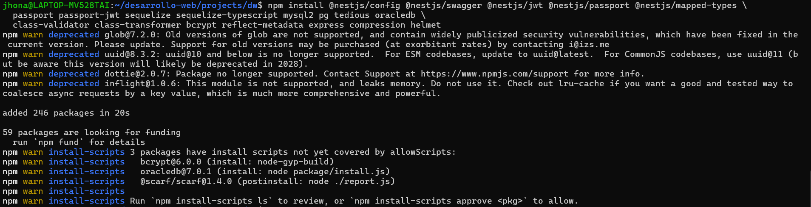
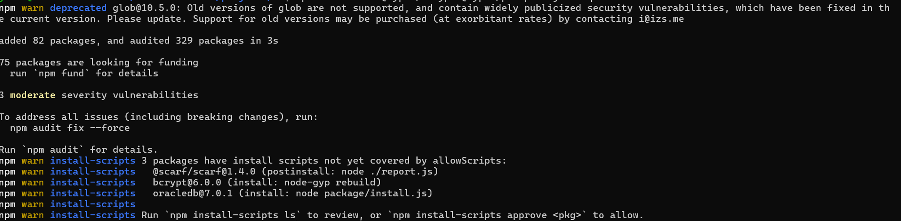

# **Manual de creación del Backend — NestJS + Sequelize (Clean Architecture)**

#### **1.1 — Crear carpetas padre y permisos**

#### **1.2 — Instalar Nest CLI** 

#### **1.3 — Crear proyecto NestJS**

#### **1.4 — Crear `.env` mínimo (puerto)**

## **FASE 2 — `01_BASE_DEPS_Y_PUERTO`**

#### **2.1 — Dependencias de producción**

#### **2.2 — Dependencias de desarrollo**

