------------------------------------------------------------------------

editor_options: markdown: wrap: 72 ---

# Guía del Estudiante: Crear 4 Motores de Base de Datos con Docker Compose


------------------------------------------------------------------------

## Tabla de Contenidos

1.  [Requisitos Previos](#1-requisitos-previos)
2.  [Paso 1: Crear Carpetas](#2-paso-1-crear-carpetas)
3.  [Paso 2: Crear la Red Docker Compartida](#3-paso-2-crear-la-red-docker-compartida)
4.  [Paso 3: MySQL](#4-paso-3-mysql)
5.  [Paso 4: PostgreSQL](#5-paso-4-postgresql)
6.  [Paso 5: SQL Server](#6-paso-5-sql-server)
7.  [Paso 6: Oracle XE](#7-paso-6-oracle-xe)
8.  [Paso 7: Scripts de Control](#8-paso-7-scripts-de-control)
9.  [Paso 8: Levantar Todo](#9-paso-8-levantar-todo)
10. [Paso 9: Crear Usuarios con Acceso Remoto](#10-paso-9-crear-usuarios-con-acceso-remoto)
11. [Anexos](#11-anexos)

------------------------------------------------------------------------

## 1. Requisitos Previos

- WSL2 instalado y funcionando
- Docker funcionando dentro de WSL
- Acceso a terminal bash en WSL

Verifica Docker:

``` bash
docker --version
docker compose version
```

## 1. Verificación de Docker y Docker Compose

En esta evidencia se verifica que Docker y Docker Compose se encuentran instalados y disponibles en el entorno WSL. Estas herramientas permiten crear, administrar y ejecutar los contenedores utilizados para los diferentes motores de bases de datos.

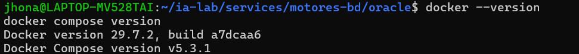


------------------------------------------------------------------------

## 2. Paso 1: Crear Carpetas

Abre tu terminal WSL y ejecuta:

``` bash
mkdir -p ~/ia-lab/services/motores-bd/{mysql,postgres,mssql,oracle}
mkdir -p ~/ia-lab/data/{mysql,postgres,mssql,oracle}
```

Verifica la estructura:

``` bash
tree ~/ia-lab/
```

Debería verse así:

```         
~/ia-lab/
├── services/
│   └── motores-bd/
│       ├── mysql/
│       ├── postgres/
│       ├── mssql/
│       └── oracle/
└── data/
    ├── mysql/
    ├── postgres/
    ├── mssql/
    └── oracle/
```

## 2. Creación de la estructura de carpetas

Se creó la estructura de directorios del proyecto `ia-lab`, organizando los servicios y los datos de cada motor de base de datos. Esta organización permite mantener separados los archivos de configuración y los datos de MySQL, PostgreSQL, SQL Server y Oracle.

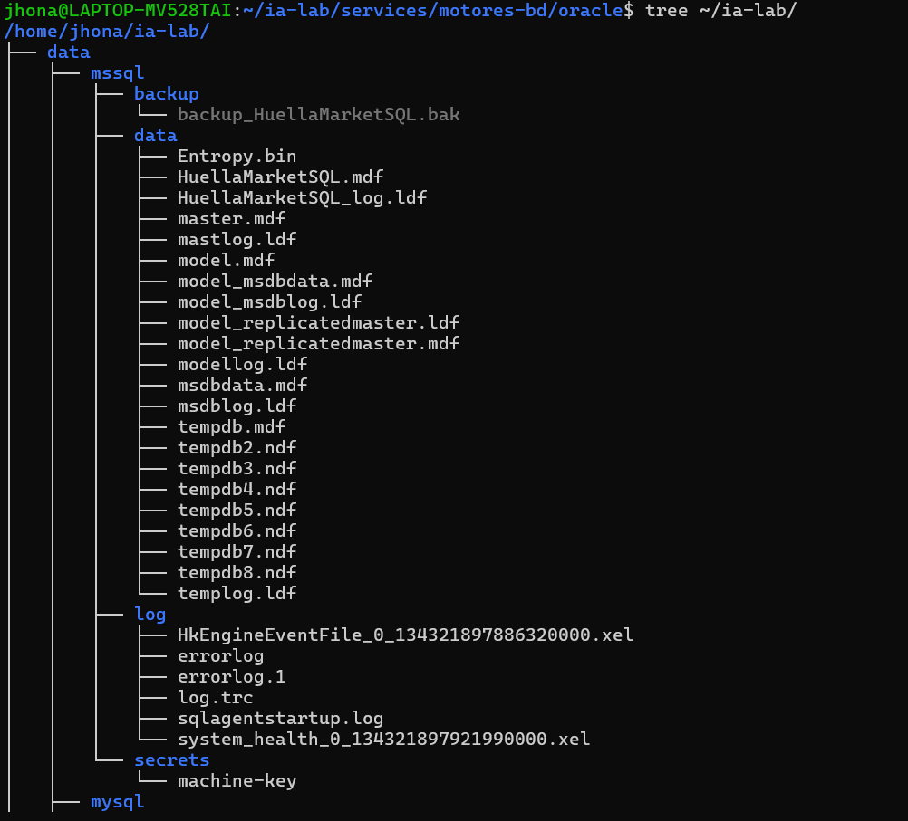


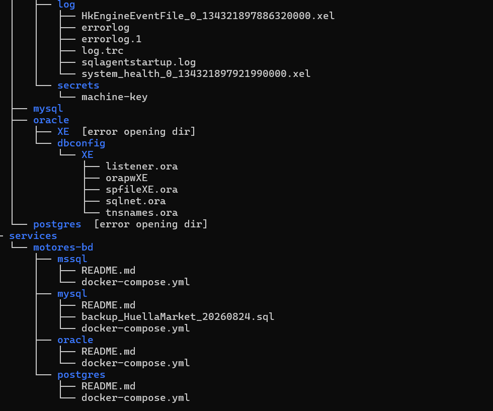

------------------------------------------------------------------------

## 3. Paso 2: Crear la Red Docker Compartida

Todos los contenedores compartirán una misma red Docker para comunicarse entre sí:

``` bash
docker network inspect ia-lab-network >/dev/null 2>&1 || docker network create ia-lab-network
```

Verifica que se creó:

``` bash
docker network ls | grep ia-lab
```

## 3. Creación de la red Docker compartida

Se creó la red Docker `ia-lab-network`, utilizada para permitir la comunicación entre los diferentes contenedores del proyecto. De esta manera, los motores de bases de datos pueden trabajar dentro de una misma red Docker.

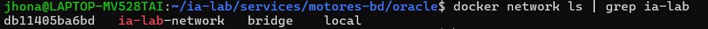


------------------------------------------------------------------------

## 4. Paso 3: MySQL

### 4.1 Crear el archivo docker-compose.yml

``` bash
cat > ~/ia-lab/services/motores-bd/mysql/docker-compose.yml << 'EOF'
services:
  mysql:
    image: mysql:8.0
    container_name: mysql-server
    restart: unless-stopped
    env_file:
      - .env
    ports:
      - "3306:3306"
    volumes:
      - ../../../data/mysql:/var/lib/mysql
      - /mnt/d/academia/bd:/backups
    command: >
      --character-set-server=utf8mb4
      --collation-server=utf8mb4_unicode_ci
      --bind-address=0.0.0.0
    networks:
      - ia-lab-network
    healthcheck:
      test: ["CMD", "mysqladmin", "ping", "-h", "localhost"]
      interval: 10s
      timeout: 5s
      retries: 5
      start_period: 30s

networks:
  ia-lab-network:
    external: true
EOF
```
## 4. Configuración de MySQL

En esta evidencia se muestra el archivo `docker-compose.yml` utilizado para configurar el contenedor de MySQL 8.0. Se establecen el puerto, el almacenamiento persistente, la red compartida y el acceso al motor de base de datos.

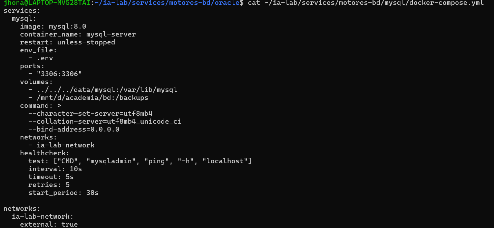


### 4.2 Crear el archivo .env

``` bash
cat > ~/ia-lab/services/motores-bd/mysql/.env << 'EOF'
TZ=America/Bogota
MYSQL_ROOT_PASSWORD=MiNiCo57**
MYSQL_DATABASE=tecnogua
EOF
```

## 5. Variables de entorno de MySQL

El archivo `.env` contiene las variables necesarias para configurar MySQL, como la contraseña del usuario `root`, la zona horaria y la base de datos que se crea durante la inicialización del contenedor.

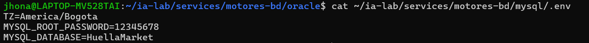


### 4.3 Crear README.md

``` bash
cat > ~/ia-lab/services/motores-bd/mysql/README.md << 'EOF'
# MySQL 8.0 - Motor de Base de Datos

> **Acceso remoto habilitado.** Puerto expuesto en `0.0.0.0:3306`.
> **Usuario por defecto:** `root` (acceso remoto: `%`)

---

## Conectar desde WSL (local)

```bash
docker exec -it mysql-server mysql -u root -p
# Password: MiNiCo57**
```
## 6. README de MySQL

El archivo README documenta la configuración de MySQL y proporciona las instrucciones necesarias para realizar conexiones locales y remotas al motor de base de datos.

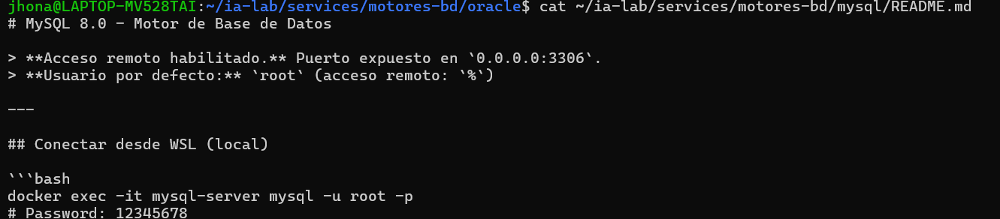


## Conectar remotamente desde cualquier equipo

Reemplaza `IP_SERVIDOR` por la IP de la maquina WSL:

``` bash
mysql -h IP_SERVIDOR -P 3306 -u root -p
```

O con cliente grafico (MySQL Workbench, DBeaver, HeidiSQL): - **Host:** `IP_SERVIDOR` - **Port:** `3306` - **User:** `root` - **Password:** `MiNiCo57**`

## Crear un usuario PROPIO con ACCESO REMOTO

Conectate primero como root, luego ejecuta:

``` sql
-- Crear la base de datos
CREATE DATABASE mi_nueva_bd CHARACTER SET utf8mb4 COLLATE utf8mb4_unicode_ci;

-- Crear usuario propio con acceso desde CUALQUIER equipo (%)
CREATE USER 'mi_usuario'@'%' IDENTIFIED BY 'MiNuevaPasswordFuerte123';

-- Dar permisos sobre la base de datos
GRANT ALL PRIVILEGES ON *.* TO 'admin'@'%';
GRANT ALL PRIVILEGES ON mi_nueva_bd.* TO 'mi_usuario'@'%';
FLUSH PRIVILEGES;
```

## Backup de una base de datos

``` bash
docker exec mysql-server mysqldump -u root -pMiNiCo57** mi_nueva_bd > /mnt/d/academia/bd/backup_mi_nueva_bd_$(date +%Y%m%d).sql
```

## Variables clave del .env

| Variable              | Descripcion                                      |
|-----------------------|--------------------------------------------------|
| `MYSQL_ROOT_PASSWORD` | Password del usuario root                        |
| `MYSQL_DATABASE`      | Base de datos creada automaticamente al arrancar |

EOF

```         

### 4.4 Levantar MySQL

```bash
cd ~/ia-lab/services/motores-bd/mysql
docker compose up -d
```

Verificar que está corriendo:

``` bash
docker ps | grep mysql-server
docker logs mysql-server --tail 20
```

------------------------------------------------------------------------

## 5. Paso 4: PostgreSQL

### 5.1 Crear docker-compose.yml

``` bash
cat > ~/ia-lab/services/motores-bd/postgres/docker-compose.yml << 'EOF'
services:
  postgres:
    image: postgres:17
    container_name: ia-postgres
    restart: unless-stopped
    env_file:
      - .env
    ports:
      - "5433:5432"
    volumes:
      - ../../../data/postgres:/var/lib/postgresql/data
    networks:
      - ia-lab-network
    healthcheck:
      test: ["CMD-SHELL", "pg_isready -U $$POSTGRES_USER -d $$POSTGRES_DB"]
      interval: 10s
      timeout: 5s
      retries: 5
      start_period: 20s

networks:
  ia-lab-network:
    external: true
EOF
```
## 8. Configuración de PostgreSQL

Se muestra el archivo `docker-compose.yml` utilizado para desplegar PostgreSQL 17 mediante Docker. En él se configura el contenedor, el puerto de acceso, el almacenamiento persistente, la red compartida y el sistema de verificación de estado.

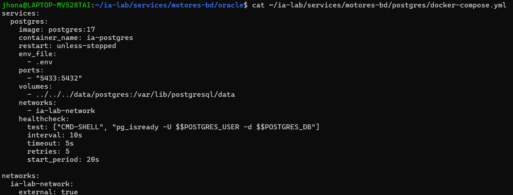


### 5.2 Crear .env

``` bash
cat > ~/ia-lab/services/motores-bd/postgres/.env << 'EOF'
TZ=America/Bogota
POSTGRES_DB=ialab
POSTGRES_USER=ialab
POSTGRES_PASSWORD=MiNiCo57**
PGDATA=/var/lib/postgresql/data
EOF
```
## 9. Variables de entorno de PostgreSQL

El archivo `.env` contiene las variables de configuración de PostgreSQL, incluyendo el nombre de la base de datos, el usuario, la contraseña y la ubicación de los datos.

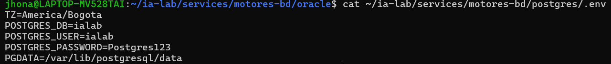

### 5.3 Crear README.md

``` bash
cat > ~/ia-lab/services/motores-bd/postgres/README.md << 'EOF'
# PostgreSQL 17 - Motor de Base de Datos

> **Acceso remoto habilitado.** Puerto expuesto en `0.0.0.0:5433`.
> **Usuario por defecto:** `ialab` (acceso remoto: sin restriccion de host)

---

## Conectar desde WSL (local)

```bash
docker exec -it ia-postgres psql -U ialab -d ialab
# Password: MiNiCo57**
```
## 10. README de PostgreSQL

El README contiene la documentación básica del motor PostgreSQL y los comandos necesarios para realizar una conexión local al contenedor.

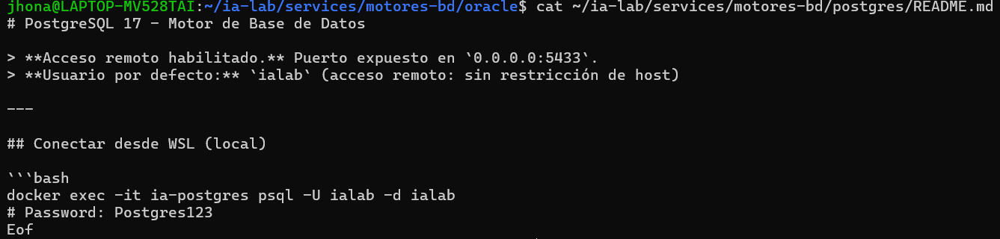


## Conectar remotamente desde cualquier equipo

``` bash
psql -h IP_SERVIDOR -p 5433 -U ialab -d ialab
```

O con cliente grafico (pgAdmin, DBeaver): - **Host:** `IP_SERVIDOR` - **Port:** `5433` - **User:** `ialab` - **Password:** `MiNiCo57**` - **Database:** `ialab`

## Crear un usuario PROPIO con ACCESO REMOTO

``` sql
-- Crear la base de datos
CREATE DATABASE mi_nueva_bd;

-- Crear usuario propio (por defecto puede conectarse desde cualquier host)
CREATE USER mi_usuario WITH PASSWORD 'MiNuevaPasswordFuerte123';

-- Dar permisos sobre la base de datos
GRANT ALL PRIVILEGES ON DATABASE mi_nueva_bd TO mi_usuario;
ALTER DATABASE mi_nueva_bd OWNER TO mi_usuario;
```

## Backup de una base de datos

``` bash
docker exec ia-postgres pg_dump -U ialab -d mi_nueva_bd > /mnt/d/academia/bd/backup_mi_nueva_bd_$(date +%Y%m%d).sql
```

## Variables clave del .env

| Variable            | Descripcion                              |
|---------------------|------------------------------------------|
| `POSTGRES_USER`     | Usuario administrador (ialab)            |
| `POSTGRES_PASSWORD` | Password del administrador               |
| `POSTGRES_DB`       | Base de datos inicial creada al arrancar |

EOF

```         

### 5.4 Levantar PostgreSQL

```bash
cd ~/ia-lab/services/motores-bd/postgres
docker compose up -d
```

> **⚠️ Nota sobre permisos:** El contenedor de PostgreSQL crea los archivos de datos con el usuario interno `dnsmasq` (UID 999). Si listas `~/ia-lab/data/postgres/` y parece vacia o inaccesible, ejecuta:
>
> ``` bash
> sudo ls -la ~/ia-lab/data/postgres/
> ```
>
> O bien, dale permisos de lectura a tu usuario:
>
> ``` bash
> sudo chmod -R 755 ~/ia-lab/data/postgres/
> ```
>
> El contenedor seguira funcionando perfectamente.

------------------------------------------------------------------------

## 6. Paso 5: SQL Server

### 6.1 Crear docker-compose.yml

``` bash
cat > ~/ia-lab/services/motores-bd/mssql/docker-compose.yml << 'EOF'
services:
  mssql:
    image: mcr.microsoft.com/mssql/server:2022-latest
    container_name: sqlserver-container
    restart: unless-stopped
    user: root
    env_file:
      - .env
    ports:
      - "1433:1433"
    volumes:
      - ../../../data/mssql:/var/opt/mssql
    networks:
      - ia-lab-network

networks:
  ia-lab-network:
    external: true
EOF
```
## 11. Configuración de SQL Server

En esta evidencia se presenta el archivo `docker-compose.yml` utilizado para desplegar SQL Server 2022. Se configura el contenedor, el puerto 1433, el almacenamiento persistente y la conexión a la red Docker compartida.

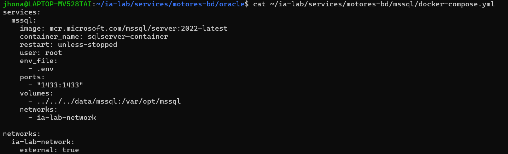


### 6.2 Crear .env

``` bash
cat > ~/ia-lab/services/motores-bd/mssql/.env << 'EOF'
ACCEPT_EULA=Y
MSSQL_SA_PASSWORD=MiNiCo57**Fuerte
MSSQL_PID=Developer
EOF
```
## 12. Variables de entorno de SQL Server

El archivo `.env` establece las variables necesarias para ejecutar SQL Server, incluyendo la aceptación de la licencia, la contraseña del usuario administrador `SA` y la edición Developer.

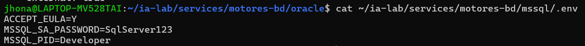


### 6.3 Crear README.md

``` bash
cat > ~/ia-lab/services/motores-bd/mssql/README.md << 'EOF'
# SQL Server 2022 - Motor de Base de Datos

> **Acceso remoto habilitado.** Puerto expuesto en `0.0.0.0:1433`.
> **Usuario por defecto:** `SA` (acceso remoto: habilitado por defecto)

---

## Conectar desde WSL (local)

```bash
docker exec -it sqlserver-container /opt/mssql-tools/bin/sqlcmd -S localhost -U SA -P 'MiNiCo57**Fuerte'
```
## 13. README de SQL Server

El README documenta la configuración del motor SQL Server y proporciona el comando necesario para realizar una conexión local mediante `sqlcmd`.

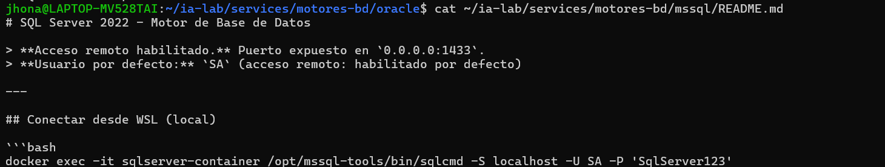


## Conectar remotamente desde cualquier equipo

``` bash
sqlcmd -S IP_SERVIDOR,1433 -U SA -P 'MiNiCo57**Fuerte'
```

O con cliente grafico (Azure Data Studio, DBeaver, SSMS): - **Host:** `IP_SERVIDOR` - **Port:** `1433` - **User:** `SA` - **Password:** `MiNiCo57**Fuerte`

## Crear un usuario PROPIO con ACCESO REMOTO

``` sql
-- Crear la base de datos
CREATE DATABASE mi_nueva_bd;
GO

-- Crear login (autenticacion a nivel servidor, acceso remoto por defecto)
CREATE LOGIN mi_usuario WITH PASSWORD = 'MiNuevaPasswordFuerte123';
GO

-- Crear usuario dentro de la base de datos
USE mi_nueva_bd;
GO
CREATE USER mi_usuario FOR LOGIN mi_usuario;
GO

-- Dar permisos de dueno de la base de datos
ALTER ROLE db_owner ADD MEMBER mi_usuario;
GO
```

## Backup de una base de datos

``` bash
docker exec sqlserver-container /opt/mssql-tools/bin/sqlcmd -S localhost -U SA -P 'MiNiCo57**Fuerte' -Q "BACKUP DATABASE [mi_nueva_bd] TO DISK = N'/var/opt/mssql/backup_mi_nueva_bd.bak'"
```

## Variables clave del .env

| Variable            | Descripcion                             |
|---------------------|-----------------------------------------|
| `MSSQL_SA_PASSWORD` | Password del usuario SA (administrador) |
| `MSSQL_PID`         | Edicion de SQL Server (Developer)       |

EOF

```         

### 6.4 Levantar SQL Server

```bash
cd ~/ia-lab/services/motores-bd/mssql
docker compose up -d
```

------------------------------------------------------------------------

## 7. Paso 6: Oracle XE

### 7.1 Crear docker-compose.yml

``` bash
cat > ~/ia-lab/services/motores-bd/oracle/docker-compose.yml << 'EOF'
services:
  oracle:
    image: gvenzl/oracle-xe
    container_name: oracle-xe
    restart: unless-stopped
    user: root
    env_file:
      - .env
    ports:
      - "1521:1521"
      - "8080:8080"
    volumes:
      - ../../../data/oracle:/opt/oracle/oradata
    networks:
      - ia-lab-network


networks:
  ia-lab-network:
    external: true
EOF
```
## 14. Configuración de Oracle XE

Esta evidencia muestra el archivo `docker-compose.yml` utilizado para configurar Oracle XE. Se establecen los puertos de comunicación, el almacenamiento persistente y la conexión con la red Docker compartida.

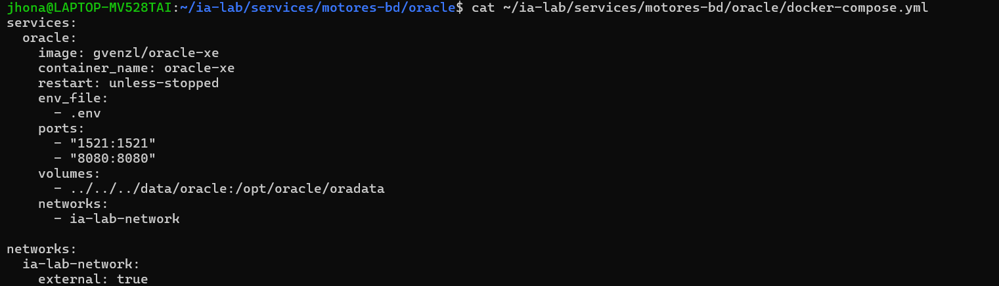


### 7.2 Crear .env

``` bash
cat > ~/ia-lab/services/motores-bd/oracle/.env << 'EOF'
ORACLE_PASSWORD=MiNiCo57**Fuerte
ORACLE_DATABASE=XE
EOF
```
## 15. Variables de entorno de Oracle XE

El archivo `.env` contiene las variables utilizadas para configurar Oracle XE, principalmente la contraseña inicial y el nombre de la base de datos.

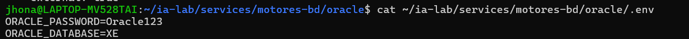


### 7.3 Crear README.md

``` bash
cat > ~/ia-lab/services/motores-bd/oracle/README.md << 'EOF'
# Oracle XE - Motor de Base de Datos

> **Acceso remoto habilitado.** Puerto expuesto en `0.0.0.0:1521`.
> **Usuario por defecto:** `SYSTEM` (acceso remoto: habilitado via listener)
>
> **⚠️ Estado actual:** Este contenedor puede tener problemas de inicializacion en WSL.
> La imagen `gvenzl/oracle-xe` requiere configuracion adicional.

---

## Conectar desde WSL (local)

```bash
docker exec -it oracle-xe sqlplus system/MiNiCo57**Fuerte@XE
```

## Conectar remotamente desde cualquier equipo

``` bash
sqlplus system/MiNiCo57**Fuerte@//IP_SERVIDOR:1521/XE
```

O con cliente grafico (SQL Developer, DBeaver): - **Host:** `IP_SERVIDOR` - **Port:** `1521` - **Service Name:** `XE` - **User:** `SYSTEM` - **Password:** `MiNiCo57**Fuerte`

## 16. README de Oracle XE

El README contiene la documentación de Oracle XE y las instrucciones para realizar una conexión local mediante SQL*Plus.

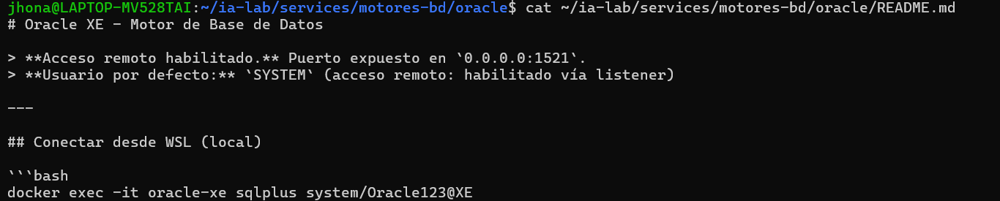


## Crear un usuario PROPIO con ACCESO REMOTO

``` sql
-- Crear tablespace para el usuario
CREATE TABLESPACE mi_ts DATAFILE '/opt/oracle/oradata/XE/mi_ts.dbf' SIZE 100M AUTOEXTEND ON;

-- Crear usuario propio (puede conectarse desde cualquier host via listener)
CREATE USER mi_usuario IDENTIFIED BY MiNuevaPasswordFuerte123 DEFAULT TABLESPACE mi_ts QUOTA UNLIMITED ON mi_ts;

-- Dar permisos basicos
GRANT CREATE SESSION, CREATE TABLE, CREATE VIEW, CREATE SEQUENCE, CREATE TRIGGER TO mi_usuario;

-- Opcional: dar permisos de DBA
GRANT DBA TO mi_usuario;
```

## Variables clave del .env

| Variable          | Descripcion                 |
|-------------------|-----------------------------|
| `ORACLE_PASSWORD` | Password del usuario SYSTEM |
| `ORACLE_DATABASE` | Nombre de la instancia (XE) |

EOF

```         

### 7.4 Levantar Oracle

```bash
cd ~/ia-lab/services/motores-bd/oracle
docker compose up -d
```

------------------------------------------------------------------------

## 8. Paso 7: Scripts de Control

### 8.1 Crear start-all.sh

``` bash
cat > ~/ia-lab/services/motores-bd/start-all.sh << 'EOF'
#!/bin/bash
set -e
BASE=~/ia-lab/services/motores-bd

echo "========================================"
echo "Iniciando motores de base de datos..."
echo "========================================"

for dir in mysql postgres mssql oracle; do
    echo ""
    echo ">>> Levantando $dir..."
    cd "$BASE/$dir"
    docker compose up -d
    echo "    $dir: OK"
done

echo ""
echo "========================================"
echo "Todos los motores iniciados."
echo "========================================"
EOF

chmod +x ~/ia-lab/services/motores-bd/start-all.sh
```

### 8.2 Crear stop-all.sh

``` bash
cat > ~/ia-lab/services/motores-bd/stop-all.sh << 'EOF'
#!/bin/bash
set -e
BASE=~/ia-lab/services/motores-bd

echo "========================================"
echo "Deteniendo motores de base de datos..."
echo "========================================"

for dir in mysql postgres mssql oracle; do
    echo ""
    echo ">>> Deteniendo $dir..."
    cd "$BASE/$dir"
    docker compose down
    echo "    $dir: OK"
done

echo ""
echo "========================================"
echo "Todos los motores detenidos."
echo "========================================"
EOF

chmod +x ~/ia-lab/services/motores-bd/stop-all.sh
```

------------------------------------------------------------------------

## 9. Paso 8: Levantar Todo

### Opcion A: Uno por uno

``` bash
cd ~/ia-lab/services/motores-bd/mysql    && docker compose up -d
cd ~/ia-lab/services/motores-bd/postgres && docker compose up -d
cd ~/ia-lab/services/motores-bd/mssql    && docker compose up -d
cd ~/ia-lab/services/motores-bd/oracle   && docker compose up -d
```

### Opcion B: Con el script

``` bash
~/ia-lab/services/motores-bd/start-all.sh
```

### Verificar estado

``` bash
docker ps --format "table {{.Names}}\t{{.Status}}\t{{.Ports}}"
```

Deberias ver algo como:

```         
NAMES               STATUS              PORTS
mysql-server        Up 30 seconds       0.0.0.0:3306->3306/tcp
ia-postgres         Up 25 seconds       0.0.0.0:5433->5432/tcp
sqlserver-container Up 20 seconds       0.0.0.0:1433->1433/tcp
oracle-xe           Up 15 seconds       0.0.0.0:1521->1521/tcp, 0.0.0.0:8080->8080/tcp
```

------------------------------------------------------------------------

## 10. Paso 9: Crear Usuarios con Acceso Remoto

> **⚠️ IMPORTANTE:** Los usuarios `root`, `ialab`, `SA` y `SYSTEM` ya tienen acceso remoto por defecto. Los pasos siguientes son para crear usuarios **adicionales** propios.

### 10.1 Descubrir la IP de tu WSL

``` bash
hostname -I
```

Anota la primera IP que aparezca (ej: `172.20.123.45`). Esa es la IP que usaran otros equipos para conectarse.

### 10.2 MySQL — Crear usuario remoto

Conectate como root:

``` bash
docker exec -it mysql-server mysql -u root -p
# Password: MiNiCo57**
```

Ejecuta:

``` sql
-- Crear base de datos
CREATE DATABASE practica_db CHARACTER SET utf8mb4 COLLATE utf8mb4_unicode_ci;

-- Crear usuario con acceso desde CUALQUIER equipo
CREATE USER 'estudiante'@'%' IDENTIFIED BY 'PasswordSegura2024!';

-- Dar permisos
GRANT ALL PRIVILEGES ON practica_db.* TO 'estudiante'@'%';
FLUSH PRIVILEGES;

-- Verificar
SELECT user, host FROM mysql.user WHERE host = '%';
```

**Conectar remotamente:**

``` bash
mysql -h 172.20.123.45 -P 3306 -u estudiante -p
```

### 10.3 PostgreSQL — Crear usuario remoto

Conectate como ialab:

``` bash
docker exec -it ia-postgres psql -U ialab -d ialab
# Password: MiNiCo57**
```

Ejecuta:

``` sql
-- Crear base de datos
CREATE DATABASE practica_db;

-- Crear usuario (puede conectarse desde cualquier host por defecto)
CREATE USER estudiante WITH PASSWORD 'PasswordSegura2024!';

-- Dar permisos
GRANT ALL PRIVILEGES ON DATABASE practica_db TO estudiante;
ALTER DATABASE practica_db OWNER TO estudiante;

-- Verificar
\du
```

**Conectar remotamente:**

``` bash
psql -h 172.20.123.45 -p 5433 -U estudiante -d practica_db
```

### 10.4 SQL Server — Crear usuario remoto

Conectate como SA:

``` bash
docker exec -it sqlserver-container /opt/mssql-tools/bin/sqlcmd -S localhost -U SA -P 'MiNiCo57**Fuerte'
```

Ejecuta:

``` sql
-- Crear base de datos
CREATE DATABASE practica_db;
GO

-- Crear login a nivel servidor
CREATE LOGIN estudiante WITH PASSWORD = 'PasswordSegura2024!';
GO

-- Crear usuario dentro de la base de datos
USE practica_db;
GO
CREATE USER estudiante FOR LOGIN estudiante;
GO

-- Dar permisos de dueno
ALTER ROLE db_owner ADD MEMBER estudiante;
GO

-- Verificar
SELECT name, type_desc, is_disabled FROM sys.sql_logins;
GO
```

**Conectar remotamente:**

``` bash
sqlcmd -S 172.20.123.45,1433 -U estudiante -P 'PasswordSegura2024!'
```

### 10.5 Oracle — Crear usuario remoto

Conectate como SYSTEM:

``` bash
docker exec -it oracle-xe sqlplus system/MiNiCo57**Fuerte@XE
```

Ejecuta:

``` sql
-- Crear tablespace
CREATE TABLESPACE practica_ts DATAFILE '/opt/oracle/oradata/XE/practica_ts.dbf' SIZE 100M AUTOEXTEND ON;

-- Crear usuario
CREATE USER estudiante IDENTIFIED BY PasswordSegura2024! DEFAULT TABLESPACE practica_ts QUOTA UNLIMITED ON practica_ts;

-- Dar permisos
GRANT CREATE SESSION, CREATE TABLE, CREATE VIEW, CREATE SEQUENCE, CREATE TRIGGER TO estudiante;
GRANT DBA TO estudiante;

-- Verificar
SELECT username, account_status FROM dba_users WHERE username = 'ESTUDIANTE';
```

**Conectar remotamente:**

``` bash
sqlplus estudiante/PasswordSegura2024!@//172.20.123.45:1521/XE
```

------------------------------------------------------------------------

## 11. Anexos

### A. Tabla resumen de puertos

| Motor      | Puerto | Usuario por defecto | Password por defecto |
|------------|--------|---------------------|----------------------|
| MySQL      | 3306   | root                | MiNiCo57\*\*         |
| PostgreSQL | 5433   | ialab               | MiNiCo57\*\*         |
| SQL Server | 1433   | SA                  | MiNiCo57\*\*Fuerte   |
| Oracle XE  | 1521   | SYSTEM              | MiNiCo57\*\*Fuerte   |

### B. Comandos utiles

``` bash
# Ver todos los contenedores corriendo
docker ps

# Ver logs de un contenedor
docker logs mysql-server --tail 50 -f
docker logs ia-postgres --tail 50 -f
docker logs sqlserver-container --tail 50 -f
docker logs oracle-xe --tail 50 -f

# Detener un motor individual
cd ~/ia-lab/services/motores-bd/mysql && docker compose down

# Detener todos los motores
~/ia-lab/services/motores-bd/stop-all.sh

# Eliminar volumenes (borra TODOS los datos)
docker compose down -v
```

### C. Clientes graficos recomendados

| Motor | Cliente grafico | Descarga |
|------------------|---------------------------------|---------------------|
| MySQL | MySQL Workbench | <https://dev.mysql.com/downloads/workbench/> |
| MySQL | DBeaver (Universal) | <https://dbeaver.io/download/> |
| PostgreSQL | pgAdmin | <https://www.pgadmin.org/download/> |
| PostgreSQL | DBeaver | <https://dbeaver.io/download/> |
| SQL Server | Azure Data Studio | <https://aka.ms/azuredatastudio> |
| SQL Server | SSMS (Windows) | <https://aka.ms/ssmsfullsetup> |
| Oracle | SQL Developer | <https://www.oracle.com/database/sqldeveloper/> |
| Oracle | DBeaver | <https://dbeaver.io/download/> |

### D. Diagrama de la arquitectura completa (IA Lab)

```         
┌─────────────────────────────────────────────────────────────────────────────┐
│                              WINDOWS HOST                                    │
│  ┌─────────────────┐  ┌─────────────────┐  ┌──────────────┐  ┌─────────────┐ │
│  │ MySQL Workbench │  │    DBeaver      │  │   pgAdmin    │  │  Navegador  │ │
│  └────────┬────────┘  └────────┬────────┘  └──────┬───────┘  └──────┬──────┘ │
└───────────┼────────────────────┼──────────────────┼─────────────────┼────────┘
            │                    │                  │                 │
            │  IP_WSL:3306       │  IP_WSL:5433     │  localhost:3000 │
            │  IP_WSL:1433       │  IP_WSL:1521     │  localhost:3001 │
            │                    │                  │  localhost:11434│
            ▼                    ▼                  ▼                 ▼
┌─────────────────────────────────────────────────────────────────────────────┐
│                              WSL / DOCKER                                    │
│                                                                              │
│  ┌─────────────┐ ┌─────────────┐ ┌──────────┐ ┌─────────┐  ┌─────────────┐  │
│  │mysql-server │ │ ia-postgres │ │sqlserver │ │oracle-xe│  │   ollama    │  │
│  │   :3306     │ │   :5433     │ │  :1433   │ │  :1521  │  │  :11434     │  │
│  └──────┬──────┘ └──────┬──────┘ └────┬─────┘ └────┬────┘  └──────┬──────┘  │
│         │               │             │            │              │         │
│         └───────────────┴─────────────┴────────────┘              │         │
│                              │                                    │         │
│                       ia-lab-network                              │         │
│                              │                                    │         │
│  ┌───────────────────────────┴────────────────────────────┐       │         │
│  │              open-webui (:8080 → :3000)                 │◄────┘         │
│  │              openhands  (:3000 → :3001)                 │◄──────────────┘
│  └─────────────────────────────────────────────────────────┘               │
└─────────────────────────────────────────────────────────────────────────────┘
```

------------------------------------------------------------------------

**Autor:** TECNOGUA AI Lab\
**Version:** 1.0\
**Fecha:** 2026-08-05
